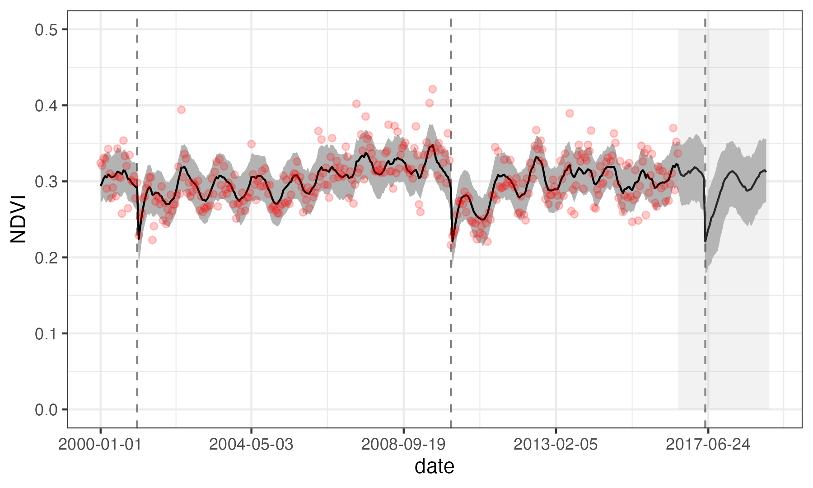

## A state-space model of vegetation activity and fire recovery in the Cape Floristic Region

The model uses the following state update equation:

$$x_{i,t} = (x_{i,t-1} + x_{i,t-1}\lambda_i(1-\frac{x_{i,t-1}}{\gamma_i})) (1-z_{i,t-1}) + z_{i,t-1}\alpha_i +  A_i\sin(v_t+\phi_i) +  \epsilon_{i,t}$$

$$\epsilon_{i,t} \sim \mathcal{N}(0,\sigma_p^{2})$$

$$y_{i,t} \sim \mathcal{N}(x_{i,t},\sigma_o^{2})$$

This represents logistic growth with seasonality and a fire switch that resets the vegetation state.  

$x_{i,t}$ is the hidden state for site $i$ at time $t$  

 $z_{i,t}$ is the observed occurrence of fire
 
 $v_{i,t}$ is the day of year in radians
 
 $A_i\sin(x_t+\phi_i)$ introduces seasonality.   
 
  $y_{i,t}$ is the observed NDVI
  
  
 $\lambda, \gamma, \alpha, A$ and $\phi$ are the parameters for growth rate, max ndvi, ndvi immediately after fire, seasonal amplitude, and seasonal phase shift respectively

An example time series below shows the median estimated state (black line) with 90% CI (dark shaded area) and observations (red points). Forecast future states are shown in the light gray shaded area

